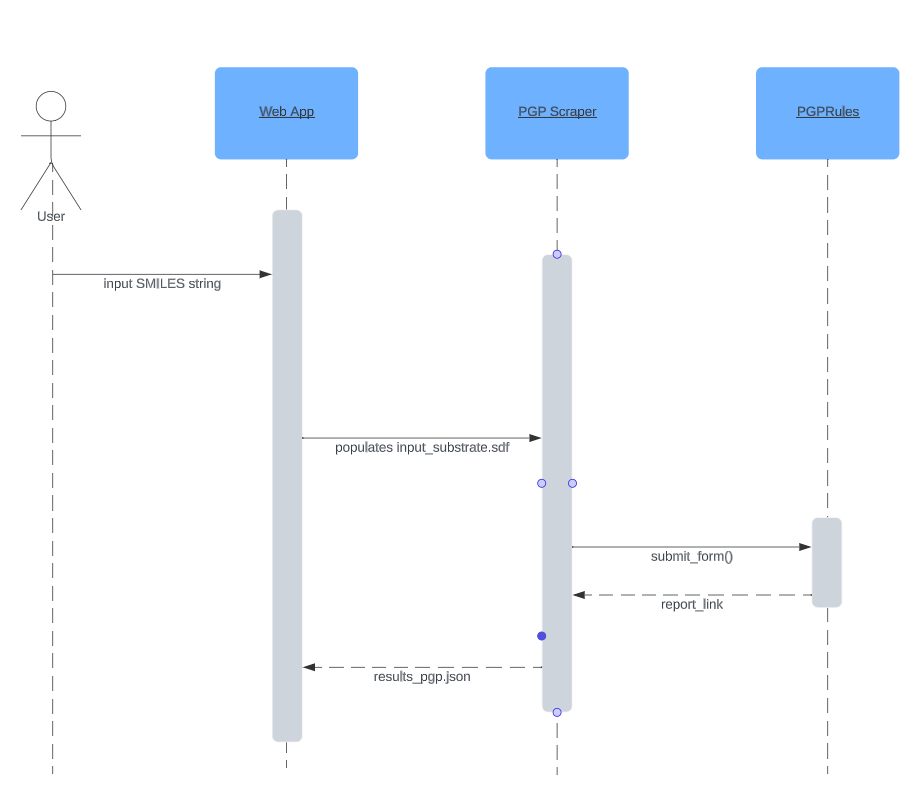

# cs361_portfolioprj: Partner Microservice Implementation

**language:** python

**purpose:** Scrapes substrate predictive property results from https://pgprules.cmdm.tw/

**To Use:** first install beautiful soup (pip install beautifulsoup4) and the requests-html package (pip install requests-html)

### **Description:** 
Program submits SDF file from user (contents found in input_substrate.sdf), selects a "Substrate" prediction type and submits form to site. It then follows the resulting report link and scrapes the molecule ID and whether the molecule is "substrate" or "non-substrate" and returns the results in a JSON file called "results_pgp.json"

## Requesting Data
To request data from this microservice: populate input_substrate.sdf. The program continuously monitors this file, and when populated, will submit the form and scrape results based on its contents. When the results have been captured, the program clears the SDF file in order to accurately look for the next input. 

input_substrate.sdf begins as a blank file. An example of a request is populating the file with the following content: 

                    FYI-1002017
                    FYIcenter.com
                    
                      6  6  0  0  0  0  0  0  0  0999 V2000
                       -0.8660   -0.5000    0.0000 C   0  0  0  0  0  0  0  0  0  0  0  0
                       -1.7321   -0.0000    0.0000 C   0  0  0  0  0  0  0  0  0  0  0  0
                       -1.7321    1.0000    0.0000 C   0  0  0  0  0  0  0  0  0  0  0  0
                       -0.8660    1.5000    0.0000 C   0  0  0  0  0  0  0  0  0  0  0  0
                       -0.0000    1.0000    0.0000 C   0  0  0  0  0  0  0  0  0  0  0  0
                        0.0000    0.0000    0.0000 C   0  0  0  0  0  0  0  0  0  0  0  0
                      1  6  1  0  0  0  0
                      1  2  2  0  0  0  0
                      2  3  1  0  0  0  0
                      3  4  2  0  0  0  0
                      4  5  1  0  0  0  0
                      5  6  2  0  0  0  0
                    M  END
                    $$$$

The above is a sample sdf file for Benzene. 

## Receiving Data
To Receive Data from this microservice, open the results_pgp.json and parse the results. 

An example of this would be: 
                  '''python
                  import json
                  with open('results_pgp.json') as results_file:
                    file_contents = results_file.read()
                    parsed_json = json.loads(file_contents)
                  '''
example output: 
                  [
                      {
                          "id": "CGP_41251",
                          "substrate_stat": "Substrate"
                      }
                  ]

## **UML Sequence Diagram**

## For Help: 
Contact Kristen (McDonald) Haynes for assistance. (mcdokris@oregonstate.edu)

